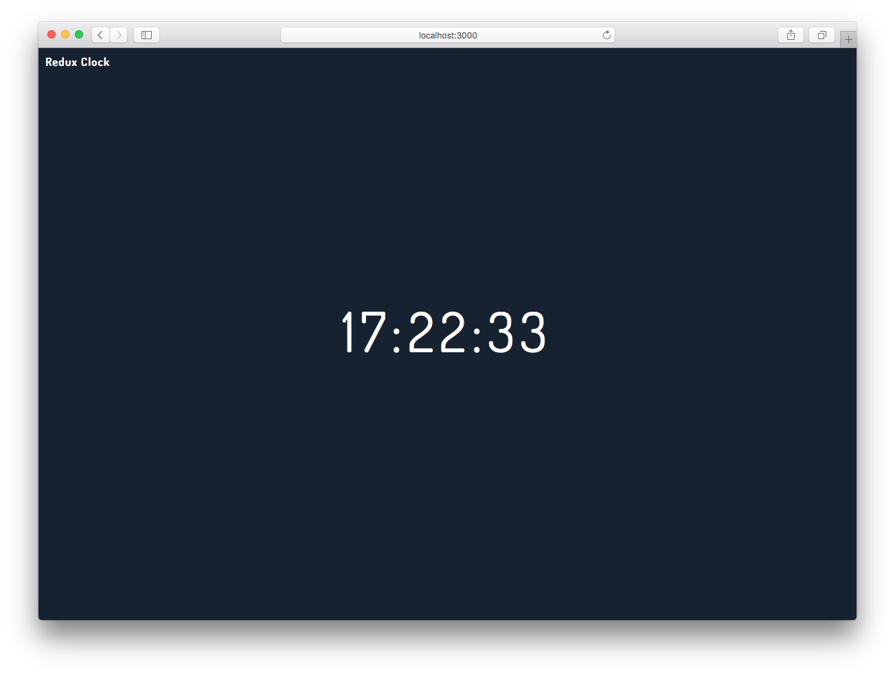

react-redux
===========


[http://tsuyoshiwada.github.io/redux-samples/clock/dist/](http://tsuyoshiwada.github.io/redux-samples/clock/dist/)

`Redux`を使って、定期的なアクションの実行を行うサンプルです。

このディレクトリへ移動して、必要なライブラリをインストールします。

```
$ npm install
```

以下のコマンドで、ローカルサーバが立ち上がりデフォルトのブラウザが立ち上がります。

```
$ npm start
```

ファイルをビルドする場合は以下。

```
$ npm run build
```